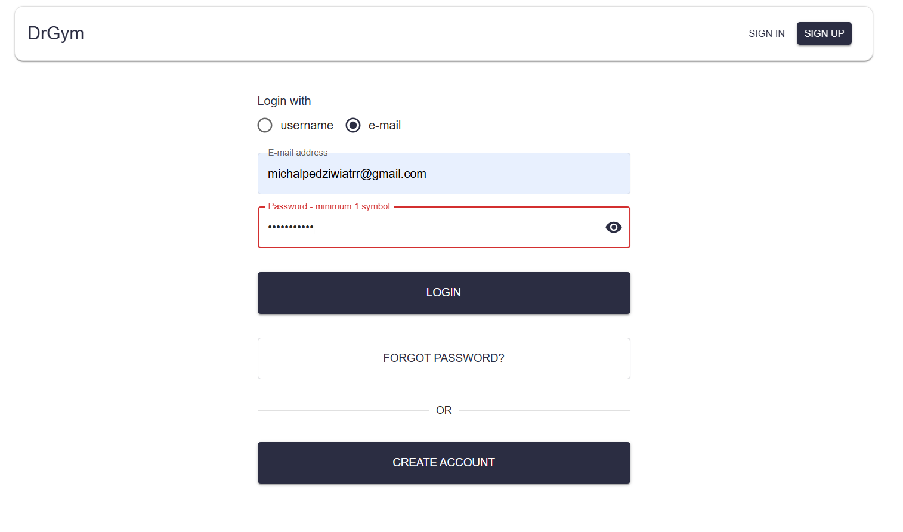
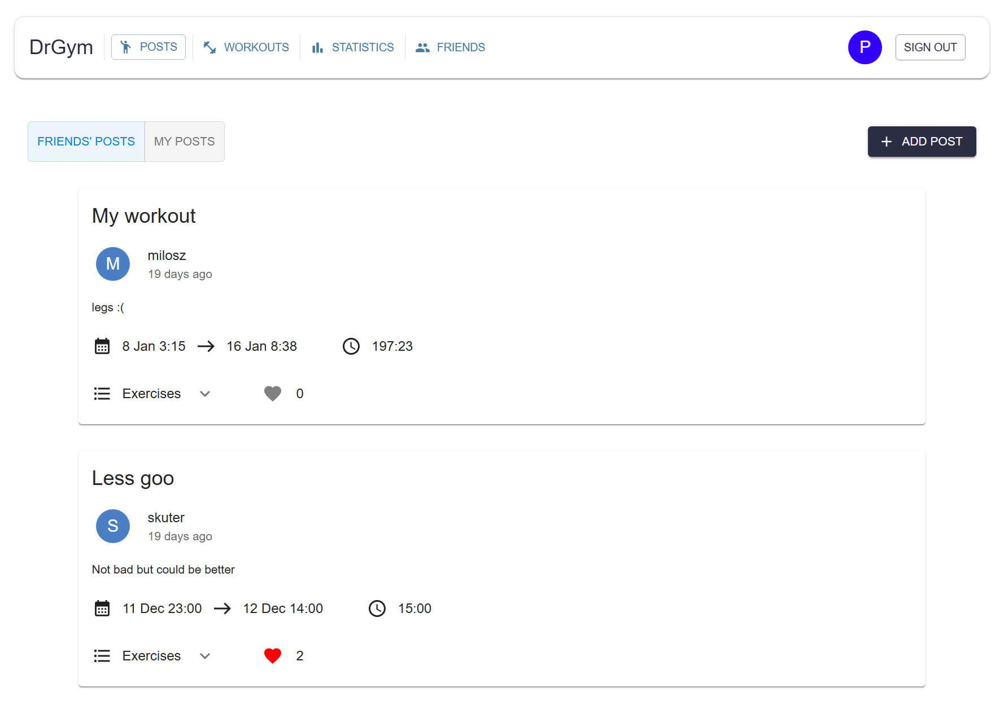

# "DrGym" - Gym Workout Tracker

### Authors
* **Michał Pędziwiatr**
* **Kacper Siemionek**
* **Miłosz Andryszczuk**
* **Jakub Skibicki**

---

## Table of Contents
* [Application Demo](#application-demo)
* [Project Overview](#-project-overview)
* [Key Features](#key-features)
* [Tech Stack](#tech-stack)

---

## Application Demo

### Video showcase
<video src="demo_media/drgym_demo.mp4" width="800" controls>
Your browser does not support the video tag.
</video>

### Screenshots Gallery

Click to expand/collapse screenshots

---
### Logging In

### Statistics, Calendar & Rankings

### Workout History

### Logging a Workout

### Social Feed

### Embedded Exercise Database

---

## Project Overview

A full-stack social fitness tracker designed to log workouts, visualize progress, and connect with friends.

This project combines detailed workout logging with a motivational social feed, allowing users to track their progress, compete on leaderboards, and share their fitness journey with others.

---

## Key Features

### Interactive Workout Logging
Users can create, manage, and review detailed workout sessions. Log every set, rep, and weight to track progress over time.

* Log strength, cardio, or crossfit exercises.
* Review past workouts in a clean, chronological list.
* Set workouts as "Public" to share with friends or "Private."
* Edit sessions using an intuitive modal.

### Advanced Statistics & Rankings
Visualize your hard work with a personal statistics dashboard.

* **Workout Calendar:** A GitHub-style activity graph tracks your consistency over the last year.
* **Muscle Heatmap:** An anatomical diagram highlights your most-worked muscle groups.
* **Rankings:** Compete with friends on leaderboards for max weights on specific exercises.

### Social Feed & Friends System
Stay motivated by connecting with your fitness community.

* Add friends via username and manage friend requests.
* View a "Friends' Posts" feed to see their public workouts.
* Like and comment on posts.
* Post your own workouts or simple status updates.

### Embedded Exercise Database
Browse a comprehensive list of exercises, complete with video instructions.

* Filter exercises by type (Strength, Cardio, Crossfit).
* Watch embedded YouTube videos directly within the app to perfect your form.

### Authentication & Profile Customization
Secure account management with full customization.

* Secure sign-up, login (by email or username), and password reset functionality.
* Customize your profile with personal details, weight, height, and a custom avatar color.
* Set your "Favourite Exercise" to display on your profile.

---

## Tech Stack

### Backend
* **Java 17**
* **Spring Boot 3**
* Spring Security (JWT Authentication)
* Spring Data JPA (Hibernate)
* Maven

### Frontend
* **React (Next.js)**
* JavaScript (ES6+)
* Material-UI (MUI)
* Axios

### Database
* **Oracle SQL**